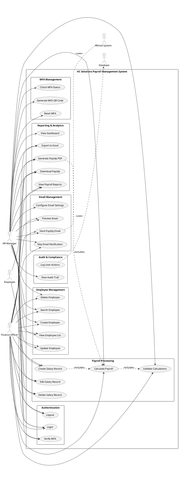
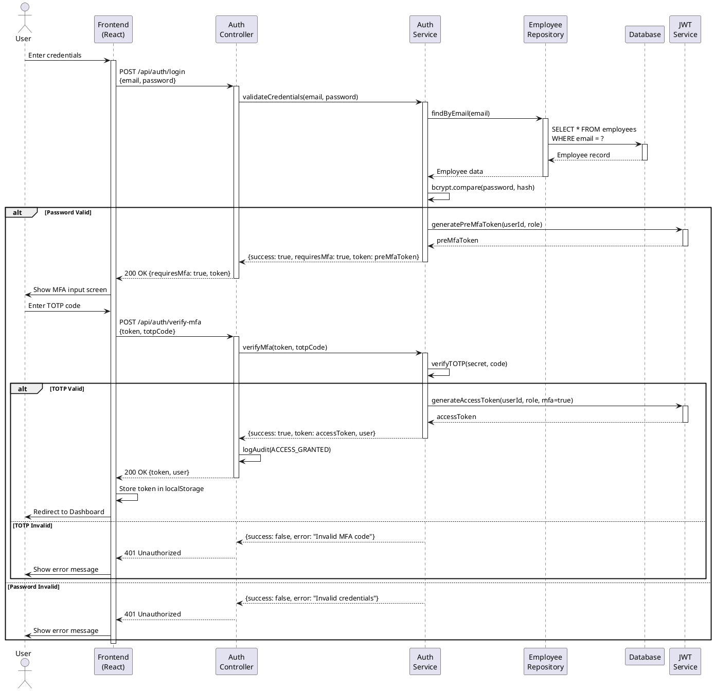
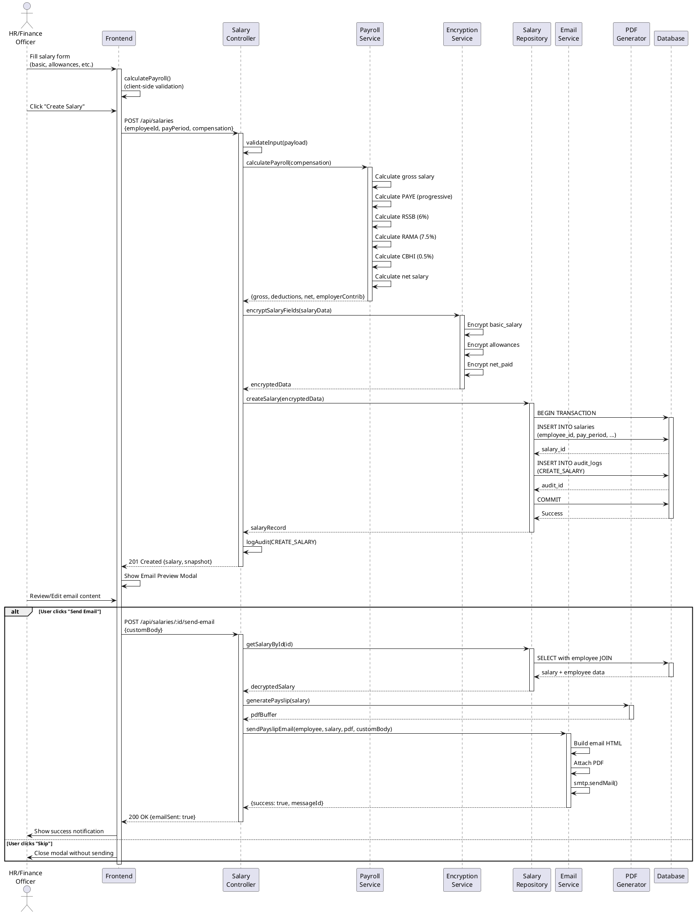
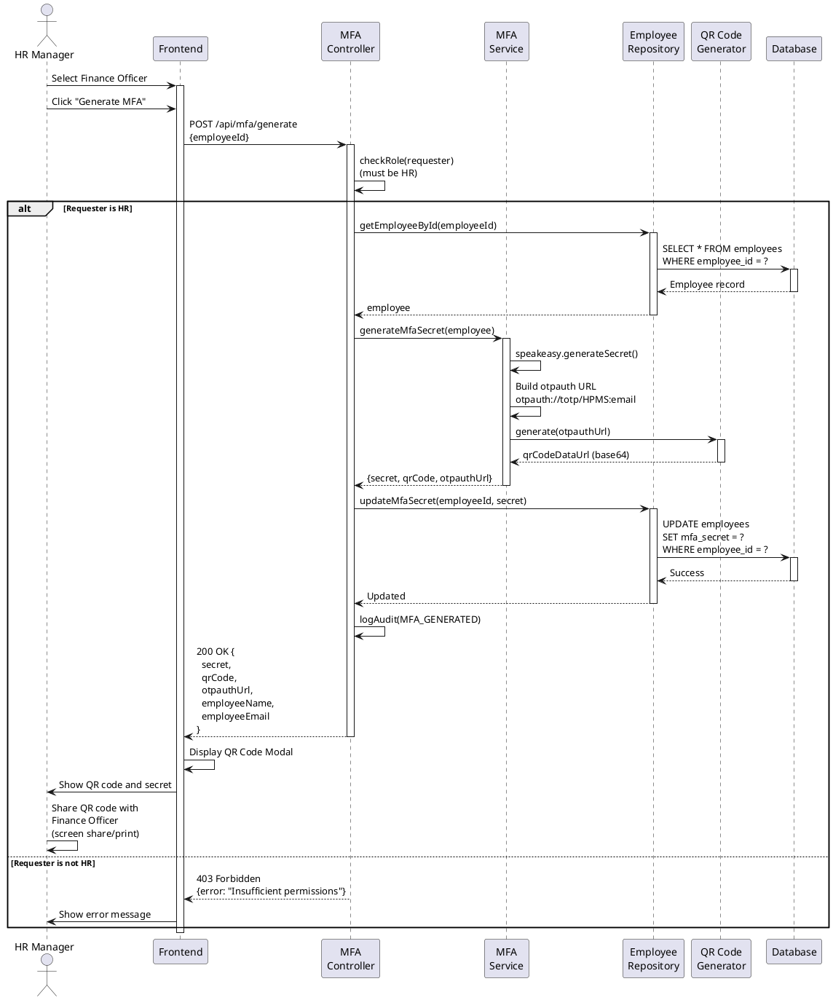
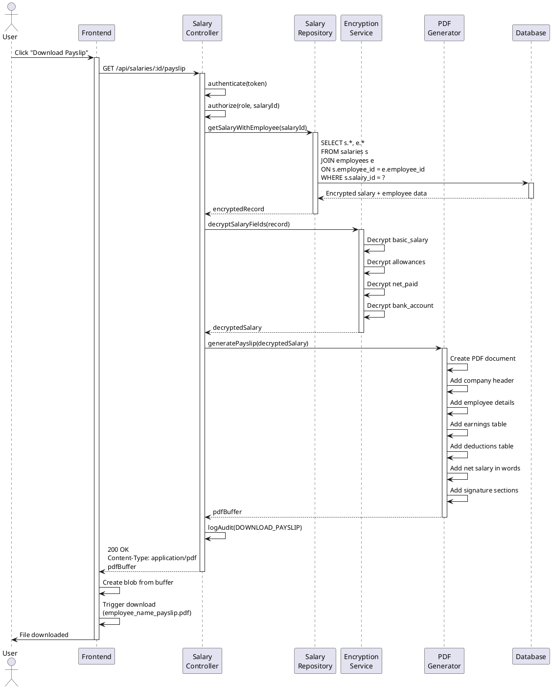

# HC Solutions Payroll Management System - UML Diagrams

## Table of Contents
1. [Use Case Diagram](#1-use-case-diagram)
2. [Sequence Diagrams](#2-sequence-diagrams)
3. [Activity Diagrams (Swimlane)](#3-activity-diagrams-swimlane)
4. [Class Diagram](#4-class-diagram)

---

## 1. Use Case Diagram

### System Actors and Use Cases



### Use Case Descriptions

| Use Case ID | Use Case Name | Actor | Description |
|-------------|---------------|-------|-------------|
| UC1 | Login | HR, FO, Employee | Authenticate user with email and password |
| UC2 | Verify MFA | HR, FO | Verify TOTP code from authenticator app |
| UC3 | Logout | HR, FO, Employee | End user session |
| UC4 | Create Employee | HR, FO | Add new employee to system |
| UC5 | View Employee List | HR, FO | Display all employees with search/filter |
| UC6 | Update Employee | HR, FO | Modify employee information |
| UC7 | Delete Employee | HR, FO | Remove employee from system |
| UC8 | Search Employee | HR, FO | Find employees by name/email |
| UC9 | Create Salary Record | HR, FO | Create new salary entry for employee |
| UC10 | Calculate Payroll | HR, FO | Compute taxes and deductions |
| UC11 | Edit Salary Record | HR, FO | Modify existing salary record |
| UC12 | Delete Salary Record | HR, FO | Remove salary record |
| UC13 | Validate Calculations | HR, FO | Verify payroll calculations |
| UC14 | View Dashboard | HR | View analytics and statistics |
| UC15 | Generate Payslip PDF | HR, FO, Employee | Create PDF payslip document |
| UC16 | Download Payslip | HR, FO, Employee | Download payslip PDF file |
| UC17 | Export to Excel | HR, FO | Export reports to XLSX format |
| UC18 | View Payroll Reports | HR, FO | View monthly payroll summaries |
| UC19 | Generate MFA QR Code | HR | Create MFA credentials for user |
| UC20 | Reset MFA | HR | Reset user's MFA settings |
| UC21 | Check MFA Status | HR | View MFA enablement status |
| UC22 | Configure Email Settings | HR | Setup SMTP configuration |
| UC23 | Preview Email | HR, FO | Review email before sending |
| UC24 | Send Payslip Email | HR, FO | Email payslip to employee |
| UC25 | Skip Email Notification | HR, FO | Opt out of sending email |
| UC26 | Log User Actions | System | Record all user activities |
| UC27 | View Audit Trail | HR | Review system audit logs |

---

## 2. Sequence Diagrams

### 2.1 User Login with MFA



### 2.2 Create Salary Record and Send Email



### 2.3 Generate MFA for Finance Officer (HR Only)



### 2.4 Download Payslip



---

## 3. Activity Diagrams (Swimlane)

### 3.1 Payroll Processing Workflow

```plantuml
@startuml
|HR/Finance Officer|
start
:Open Employee Form;
:Enter employee details;
:Enter salary components\n(basic, allowances);

|Frontend|
:Validate input fields;
:Calculate payroll\n(client-side);
:Display calculated\ndeductions and net pay;

|HR/Finance Officer|
:Review calculations;

if (Calculations correct?) then (yes)
  :Click "Create Salary";
  
  |Backend - Salary Controller|
  :Receive salary request;
  :Authenticate user;
  :Authorize role (HR/FO);
  
  |Backend - Payroll Service|
  :Calculate gross salary;
  :Calculate PAYE\n(progressive tax);
  :Calculate RSSB (6%);
  :Calculate RAMA (7.5%);
  :Calculate CBHI (0.5%);
  :Calculate net salary;
  
  |Backend - Encryption Service|
  :Encrypt sensitive fields\n(AES-256);
  
  |Backend - Salary Repository|
  :Begin transaction;
  :Insert salary record;
  :Insert audit log;
  :Commit transaction;
  
  |Backend - Salary Controller|
  :Return success response\nwith salary snapshot;
  
  |Frontend|
  :Show Email Preview Modal;
  
  |HR/Finance Officer|
  if (Send email?) then (yes)
    :Review/edit email content;
    :Click "Send Email";
    
    |Backend - Email Service|
    :Generate PDF payslip;
    :Build email with attachment;
    :Send via SMTP;
    
    |Frontend|
    :Show success notification;
    
  else (no - skip)
    :Click "Skip";
    |Frontend|
    :Close modal;
  endif
  
  |HR/Finance Officer|
  :View in Reports page;
  stop
  
else (no)
  :Adjust salary components;
  |Frontend|
  :Recalculate;
  backward:Review calculations;
endif

@enduml
```

### 3.2 MFA Setup Workflow

```plantuml
@startuml
|HR Manager|
start
:Create Finance Officer account;
:Navigate to MFA Management;
:Select Finance Officer;
:Click "Generate MFA";

|Backend - MFA Controller|
:Verify HR role;

if (User is HR?) then (yes)
  :Retrieve employee record;
  
  |Backend - MFA Service|
  :Generate TOTP secret;
  :Create otpauth URL;
  :Generate QR code (base64);
  
  |Backend - Employee Repository|
  :Update mfa_secret in database;
  
  |Backend - MFA Controller|
  :Log audit (MFA_GENERATED);
  :Return QR code and secret;
  
  |Frontend|
  :Display QR Code Modal;
  :Show secret key;
  
  |HR Manager|
  :Share QR code with\nFinance Officer\n(screen/print/secure channel);
  
  |Finance Officer|
  :Open Google Authenticator;
  :Scan QR code;
  :Save to authenticator;
  
  |Finance Officer|
  :Navigate to login page;
  :Enter email and password;
  
  |Backend - Auth Controller|
  :Validate credentials;
  :Return preMfaToken;
  
  |Frontend|
  :Show MFA input screen;
  
  |Finance Officer|
  :Enter 6-digit TOTP code\nfrom authenticator;
  
  |Backend - Auth Service|
  :Verify TOTP code;
  
  if (TOTP valid?) then (yes)
    :Generate access token\n(mfa=true);
    :Log audit (ACCESS_GRANTED);
    
    |Frontend|
    :Store token;
    :Redirect to dashboard;
    
    |Finance Officer|
    :Access granted;
    stop
    
  else (no)
    |Frontend|
    :Show error message;
    
    |Finance Officer|
    backward:Re-enter TOTP code;
  endif
  
else (no - not HR)
  |Backend - MFA Controller|
  :Return 403 Forbidden;
  
  |Frontend|
  :Show error message;
  
  |HR Manager|
  :Access denied;
  stop
endif

@enduml
```

### 3.3 Employee Management Workflow

```plantuml
@startuml
|HR/Finance Officer|
start
:Navigate to Employees page;

if (Action?) then (Create New)
  :Click "Add Employee";
  
  |Frontend|
  :Show employee form;
  
  |HR/Finance Officer|
  :Enter employee details\n(name, email, bank, etc.);
  :Click "Save";
  
  |Backend - Employee Controller|
  :Validate input;
  :Check email uniqueness;
  
  if (Email exists?) then (yes)
    |Frontend|
    :Show error message;
    |HR/Finance Officer|
    backward:Modify email;
  else (no)
    |Backend - Encryption Service|
    :Encrypt bank account number;
    
    |Backend - Employee Repository|
    :Insert employee record;
    :Log audit (CREATE_EMPLOYEE);
    
    |Frontend|
    :Show success notification;
    :Refresh employee list;
    
    |HR/Finance Officer|
    stop
  endif
  
else (Search)
  :Enter search term;
  
  |Frontend|
  :Send search request;
  
  |Backend - Employee Controller|
  :Query employees\n(name/email LIKE %term%);
  
  |Backend - Employee Repository|
  :Execute search query;
  :Return matching employees;
  
  |Frontend|
  :Display filtered results;
  
  |HR/Finance Officer|
  stop
  
else (Edit)
  :Click "Edit" on employee;
  
  |Frontend|
  :Load employee data;
  :Show edit form;
  
  |HR/Finance Officer|
  :Modify employee details;
  :Click "Update";
  
  |Backend - Employee Controller|
  :Validate changes;
  
  |Backend - Encryption Service|
  :Re-encrypt if bank details changed;
  
  |Backend - Employee Repository|
  :Update employee record;
  :Log audit (UPDATE_EMPLOYEE);
  
  |Frontend|
  :Show success notification;
  :Refresh employee list;
  
  |HR/Finance Officer|
  stop
  
else (Delete)
  :Click "Delete" on employee;
  
  |Frontend|
  :Show confirmation dialog;
  
  |HR/Finance Officer|
  if (Confirm delete?) then (yes)
    :Click "Confirm";
    
    |Backend - Employee Controller|
    :Check for existing salaries;
    
    if (Has salary records?) then (yes)
      :Cascade delete salaries;
    endif
    
    |Backend - Employee Repository|
    :Delete employee record;
    :Log audit (DELETE_EMPLOYEE);
    
    |Frontend|
    :Show success notification;
    :Refresh employee list;
    
    |HR/Finance Officer|
    stop
    
  else (no)
    :Click "Cancel";
    |Frontend|
    :Close dialog;
    |HR/Finance Officer|
    stop
  endif
endif

@enduml
```

---

## 4. Class Diagram

```plantuml
@startuml
skinparam classAttributeIconSize 0

' ============ MODELS / ENTITIES ============

class Employee {
  - employee_id: Integer {PK}
  - full_name: String
  - email: String {unique}
  - phone_number: String
  - department: String
  - date_of_joining: Date
  - bank_name: String
  - account_number_enc: ByteArray
  - account_holder_name: String
  - role: EmployeeRole
  - status: String
  - password_hash: String
  - mfa_secret: String
  - email_notifications_enabled: Boolean
  - sms_notifications_enabled: Boolean
  - created_at: DateTime
  - updated_at: DateTime
  - encryption_version: Integer
  
  + getFullName(): String
  + getEmail(): String
  + getRole(): EmployeeRole
  + isActive(): Boolean
  + hasMfaEnabled(): Boolean
}

class Salary {
  - salary_id: Integer {PK}
  - employee_id: Integer {FK}
  - pay_period: Date
  - pay_frequency: String
  - basic_salary_enc: ByteArray
  - transport_allow_enc: ByteArray
  - housing_allow_enc: ByteArray
  - variable_allow_enc: ByteArray
  - performance_allow_enc: ByteArray
  - gross_salary: Decimal
  - rssb_pension: Decimal
  - rssb_maternity: Decimal
  - rama_insurance: Decimal
  - paye: Decimal
  - cbhi: Decimal
  - advance_amount: Decimal
  - net_paid_enc: ByteArray
  - total_employer_contrib: Decimal
  - payroll_snapshot_enc: ByteArray
  - created_by: Integer {FK}
  - created_at: DateTime
  - encryption_version: Integer
  
  + getGrossSalary(): Decimal
  + getNetSalary(): Decimal
  + getTotalDeductions(): Decimal
  + getEmployerContributions(): Decimal
}

class AuditLog {
  - audit_id: BigInteger {PK}
  - timestamp: DateTime
  - user_id: Integer {FK}
  - action_type: AuditAction
  - details: JSON
  - ip_address: String
  - user_agent: String
  - correlation_id: UUID
  
  + getActionType(): String
  + getDetails(): Object
  + getTimestamp(): DateTime
}

enum EmployeeRole {
  HR
  FinanceOfficer
  Employee
}

enum AuditAction {
  LOGIN_REQUEST
  MFA_CHALLENGE
  ACCESS_GRANTED
  CREATE_EMPLOYEE
  UPDATE_EMPLOYEE
  DELETE_EMPLOYEE
  CREATE_SALARY
  UPDATE_SALARY
  DELETE_SALARY
  DOWNLOAD_PAYSLIP
  MFA_GENERATED
  MFA_RESET
  RESET_PAY_PERIOD
}

' ============ CONTROLLERS ============

class AuthController {
  - authService: AuthService
  - auditService: AuditService
  
  + login(req, res): Promise<Response>
  + verifyMfa(req, res): Promise<Response>
  + logout(req, res): Promise<Response>
}

class EmployeeController {
  - employeeService: EmployeeService
  - auditService: AuditService
  
  + createEmployee(req, res): Promise<Response>
  + getEmployees(req, res): Promise<Response>
  + getEmployeeById(req, res): Promise<Response>
  + updateEmployee(req, res): Promise<Response>
  + deleteEmployee(req, res): Promise<Response>
  + searchEmployees(req, res): Promise<Response>
}

class SalaryController {
  - salaryService: SalaryService
  - payrollService: PayrollService
  - emailService: EmailService
  - auditService: AuditService
  
  + createSalary(req, res): Promise<Response>
  + getSalaries(req, res): Promise<Response>
  + getSalaryById(req, res): Promise<Response>
  + updateSalary(req, res): Promise<Response>
  + deleteSalary(req, res): Promise<Response>
  + downloadPayslip(req, res): Promise<Response>
  + sendPayslipEmail(req, res): Promise<Response>
  + computePayroll(req, res): Promise<Response>
}

class MfaController {
  - mfaService: MfaService
  - employeeService: EmployeeService
  - auditService: AuditService
  
  + generateMfa(req, res): Promise<Response>
  + resetMfa(req, res): Promise<Response>
  + getMfaStatus(req, res): Promise<Response>
}

class DashboardController {
  - dashboardService: DashboardService
  
  + getDashboardStats(req, res): Promise<Response>
}

' ============ SERVICES ============

class AuthService {
  - employeeRepo: EmployeeRepository
  - jwtService: JwtService
  
  + validateCredentials(email, password): Promise<Employee>
  + verifyMfa(token, totpCode): Promise<Boolean>
  + generatePreMfaToken(userId, role): String
  + generateAccessToken(userId, role, mfa): String
}

class EmployeeService {
  - employeeRepo: EmployeeRepository
  - encryptionService: EncryptionService
  
  + createEmployee(data): Promise<Employee>
  + getEmployeeById(id): Promise<Employee>
  + getAllEmployees(filters): Promise<Employee[]>
  + updateEmployee(id, data): Promise<Employee>
  + deleteEmployee(id): Promise<Boolean>
  + searchEmployees(term): Promise<Employee[]>
}

class SalaryService {
  - salaryRepo: SalaryRepository
  - encryptionService: EncryptionService
  
  + createSalary(data): Promise<Salary>
  + getSalaryById(id): Promise<Salary>
  + getAllSalaries(filters): Promise<Salary[]>
  + updateSalary(id, data): Promise<Salary>
  + deleteSalary(id): Promise<Boolean>
  + getSalaryWithEmployee(id): Promise<Object>
}

class PayrollService {
  + calculatePayroll(compensation): Object
  + calculateGrossSalary(basic, allowances): Decimal
  + calculatePAYE(taxableIncome): Decimal
  + calculateRSSB(grossSalary): Object
  + calculateRAMA(basicSalary): Decimal
  + calculateCBHI(netBeforeCBHI): Decimal
  + calculateNetSalary(gross, deductions): Decimal
  + calculateEmployerContributions(basicSalary, grossSalary): Decimal
}

class MfaService {
  - employeeRepo: EmployeeRepository
  
  + generateSecret(employee): Object
  + generateQRCode(otpauthUrl): Promise<String>
  + verifyTOTP(secret, code): Boolean
  + resetMfa(employeeId): Promise<Boolean>
}

class EmailService {
  - smtpTransporter: SMTPTransport
  
  + sendPayslipEmail(employee, salary, pdfBuffer, customBody): Promise<Object>
  + buildEmailTemplate(employee, salary, customBody): String
  + testConnection(): Promise<Boolean>
}

class EncryptionService {
  - masterKey: String
  
  + encrypt(columnName, plaintext): ByteArray
  + decrypt(columnName, ciphertext): String
  + encryptSalaryFields(salary): Object
  + decryptSalaryFields(salary): Object
  + deriveColumnKey(columnName): String
}

class AuditService {
  - auditRepo: AuditRepository
  
  + log(userId, actionType, details, ip, userAgent): Promise<AuditLog>
  + getAuditLogs(filters): Promise<AuditLog[]>
}

class PdfService {
  + generatePayslip(salary, employee): Buffer
  + numberToWords(amount): String
  + formatCurrency(amount): String
}

class JwtService {
  - privateKey: String
  - publicKey: String
  
  + sign(payload, expiresIn): String
  + verify(token): Object
  + decode(token): Object
}

' ============ REPOSITORIES ============

class EmployeeRepository {
  - db: DatabasePool
  
  + create(employee): Promise<Employee>
  + findById(id): Promise<Employee>
  + findByEmail(email): Promise<Employee>
  + findAll(filters): Promise<Employee[]>
  + update(id, data): Promise<Employee>
  + delete(id): Promise<Boolean>
  + search(term): Promise<Employee[]>
}

class SalaryRepository {
  - db: DatabasePool
  
  + create(salary): Promise<Salary>
  + findById(id): Promise<Salary>
  + findAll(filters): Promise<Salary[]>
  + findByEmployeeAndPeriod(employeeId, period): Promise<Salary>
  + update(id, data): Promise<Salary>
  + delete(id): Promise<Boolean>
  + getSalaryWithEmployee(id): Promise<Object>
}

class AuditRepository {
  - db: DatabasePool
  
  + create(auditLog): Promise<AuditLog>
  + findAll(filters): Promise<AuditLog[]>
  + findByUserId(userId): Promise<AuditLog[]>
  + findByActionType(actionType): Promise<AuditLog[]>
}

' ============ MIDDLEWARE ============

class AuthMiddleware {
  - jwtService: JwtService
  
  + authenticate(req, res, next): void
  + authorize(roles): Function
  + checkMfa(req, res, next): void
}

class ErrorHandler {
  + handleError(err, req, res, next): void
  + normalizeError(err): Object
}

class RequestLogger {
  - logger: Logger
  
  + logRequest(req, res, next): void
  + attachCorrelationId(req, res, next): void
}

' ============ FRONTEND COMPONENTS ============

class LoginPage {
  - authContext: AuthContext
  
  + handleLogin(email, password): void
  + handleMfaVerify(code): void
  + render(): JSX
}

class DashboardPage {
  - dashboardService: DashboardService
  
  + fetchStats(): void
  + render(): JSX
}

class EmployeesPage {
  - employeeService: EmployeeService
  
  + fetchEmployees(): void
  + handleSearch(term): void
  + handleDelete(id): void
  + render(): JSX
}

class EmployeeFormPage {
  - employeeService: EmployeeService
  - payrollService: PayrollService
  
  + handleSubmit(data): void
  + calculatePayroll(compensation): void
  + validateForm(): Boolean
  + render(): JSX
}

class ReportsPage {
  - salaryService: SalaryService
  
  + fetchSalaries(): void
  + handleDownloadPayslip(id): void
  + handleExportExcel(): void
  + handleEdit(id): void
  + handleDelete(id): void
  + render(): JSX
}

class EmailPreviewModal {
  - emailService: EmailService
  
  + handleSend(customBody): void
  + handleSkip(): void
  + render(): JSX
}

' ============ CONTEXT / STATE ============

class AuthContext {
  - user: Employee
  - token: String
  - isAuthenticated: Boolean
  
  + login(credentials): Promise<void>
  + logout(): void
  + verifyMfa(code): Promise<void>
  + checkAuth(): Boolean
}

' ============ RELATIONSHIPS ============

' Model Relationships
Employee "1" -- "0..*" Salary : has
Employee "1" -- "0..*" AuditLog : performs
Employee -- EmployeeRole

Salary -- Employee : created_by
AuditLog -- AuditAction

' Controller -> Service
AuthController --> AuthService
AuthController --> AuditService
EmployeeController --> EmployeeService
EmployeeController --> AuditService
SalaryController --> SalaryService
SalaryController --> PayrollService
SalaryController --> EmailService
SalaryController --> AuditService
MfaController --> MfaService
MfaController --> EmployeeService
MfaController --> AuditService
DashboardController --> DashboardService

' Service -> Repository
AuthService --> EmployeeRepository
AuthService --> JwtService
EmployeeService --> EmployeeRepository
EmployeeService --> EncryptionService
SalaryService --> SalaryRepository
SalaryService --> EncryptionService
MfaService --> EmployeeRepository
AuditService --> AuditRepository
EmailService --> PdfService

' Service -> Service
SalaryController --> PdfService

' Repository -> Model
EmployeeRepository ..> Employee : creates
SalaryRepository ..> Salary : creates
AuditRepository ..> AuditLog : creates

' Middleware
AuthMiddleware --> JwtService
RequestLogger --> AuditService

' Frontend -> Backend (via API)
LoginPage ..> AuthController : HTTP
DashboardPage ..> DashboardController : HTTP
EmployeesPage ..> EmployeeController : HTTP
EmployeeFormPage ..> EmployeeController : HTTP
EmployeeFormPage ..> SalaryController : HTTP
ReportsPage ..> SalaryController : HTTP
EmailPreviewModal ..> SalaryController : HTTP

' Frontend Context
LoginPage --> AuthContext
DashboardPage --> AuthContext
EmployeesPage --> AuthContext
EmployeeFormPage --> AuthContext
ReportsPage --> AuthContext

@enduml
```



---

## Summary

This document provides comprehensive UML diagrams for the HC Solutions Payroll Management System:

1. **Use Case Diagram**: Shows all actors (HR, Finance Officer, Employee) and their interactions with 27 system use cases across 7 functional packages.

2. **Sequence Diagrams**: Details the flow of 4 critical processes:
   - User login with MFA authentication
   - Salary record creation with email notification
   - MFA generation for Finance Officers
   - Payslip download with encryption/decryption

3. **Activity Diagrams (Swimlane)**: Illustrates 3 key workflows:
   - Complete payroll processing from data entry to email
   - MFA setup process between HR and Finance Officer
   - Employee management operations (CRUD)

4. **Class Diagram**: Complete structural design showing:
   - 3 core domain models (Employee, Salary, AuditLog)
   - 5 controllers handling HTTP requests
   - 10 services implementing business logic
   - 3 repositories for data access
   - 3 middleware components
   - 6 frontend React components
   - All relationships and dependencies

These diagrams can be rendered using PlantUML tools and serve as comprehensive documentation for the system's behavioral and structural design.

